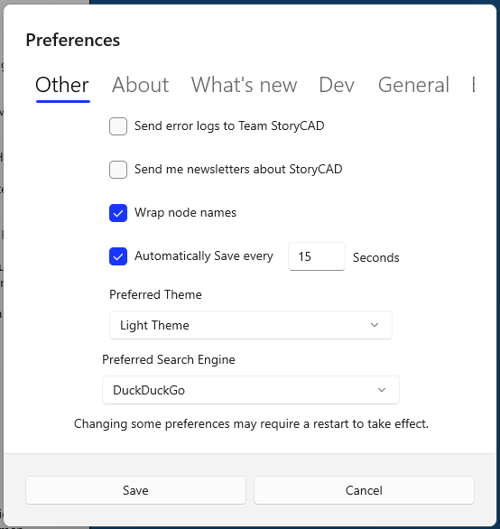
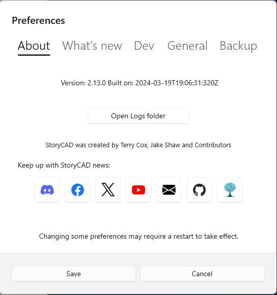

# Preferences #
Preferences  

The Preferences Dialog will be displayed when you press the Preferences button on the Menu Bar:  

<<<<<<< HEAD

=======

>>>>>>> Save refactoring of user manual in conjunction with Conflict Builder changes

The Preferences Dialog contains many options. It’s divided into a series of tabs which group the functions.  

General tab:  

The name field is used as the default Author on the Story Overview form on new outlines.  

<<<<<<< HEAD
The name and your email address are used as your StoryCAD userid. The email  
=======
The name and your email address are used as your StoryBuilder userid. The email  
>>>>>>> Save refactoring of user manual in conjunction with Conflict Builder changes
Address is also used with the elmah.io and newsletter options if you select those.  

The project directory is the default directory for new story outlines.  

Here are a list of the options (Besides information fields such as name, email etc.)  

Backup tab:  

<<<<<<< HEAD
StoryCAD backups are  zip files containing your .stbx outline.   
=======
StoryBuilder backups are  zip files containing your .stbx outline.   
>>>>>>> Save refactoring of user manual in conjunction with Conflict Builder changes

The backup directory is the folder which will hold your backups. It holds a subfolder for each outline (.stbx file) you’ve backed up; the subfolder has the individual backups of your outline:  

Make a backup when a story is opened - Makes a backup when you open a story  

Make timed backups - Makes a timed backup every so many minutes.  

Backup Frequency - How often a timed backup should be made in minutes.  

Other tab:  

Send error logs - This option uses a service, elmah.io, which collects error data and provides us with a log which gives us an idea of what happened. This information includes your your email so that we can follow up for more information if needed. Your outline data is not not retained or forwarded and no  
<<<<<<< HEAD
information is shared with anyone outside of Team StoryCAD.  

Send newsletters - Your email address will be subscribed to the StoryCAD newsletter, which is usually sent about once a month.  
=======
information is shared with anyone outside of Team StoryBuilder.  

Send newsletters - Your email address will be subscribed to the StoryBuilder newsletter, which is usually sent about once a month.  
>>>>>>> Save refactoring of user manual in conjunction with Conflict Builder changes

Wrap node names - Wraps node names in the Story Explorer and Narrator treeviews, if the Name is longer than the treeview’s display width.  

Automatically Save - This function will automatically save your story  story outline every X seconds. It operates exactly as if you’d used File | Save or clicked on the edit button on the status bar.  You’ll see a verification of the save event on the status bar and the edit button will turn green.   

About tab:  

This tab identifies the current version.  

<<<<<<< HEAD
The logs folder is a subfolder of the installation folder. It contains a list of the most recent log files written by StoryCAD (one file per day.)  

These files contain operational logs of StoryCAD sessions and if you’ve enabled exception reporting we may ask you to forward the log relevant to a reported exception, at your discretion.  

The Discord server is the community meeting place for StoryCAD users; we urge you to join us.  
=======
The logs folder is a subfolder of the installation folder. It contains a list of the most recent log files written by StoryBuilder (one file per day.)  

These files contain operational logs of StoryBuilder sessions and if you’ve enabled exception reporting we may ask you to forward the log relevant to a reported exception, at your discretion.  

The Discord server is the community meeting place for StoryBuilder users; we urge you to join us.  
>>>>>>> Save refactoring of user manual in conjunction with Conflict Builder changes

What’s New tab:  

The What’s New tab displays the Changelog for the current release.   
<<<<<<< HEAD
=======
  
  
[Prev](Reports.md)[Next](Researching_your_story.md)  
>>>>>>> Save refactoring of user manual in conjunction with Conflict Builder changes
