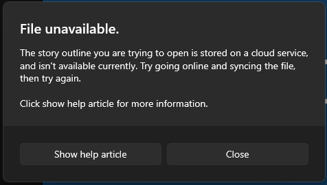
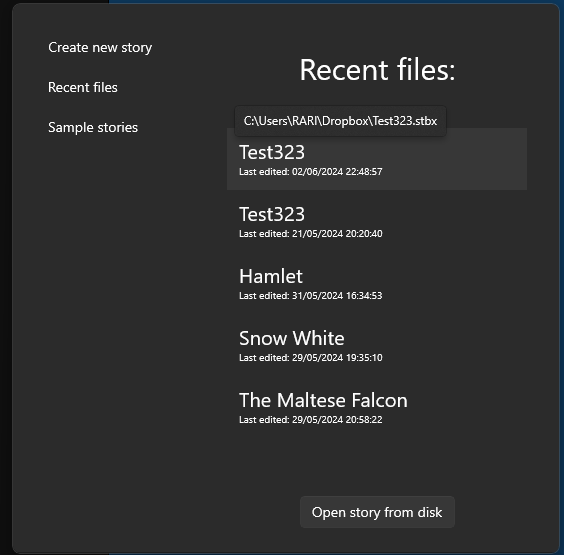
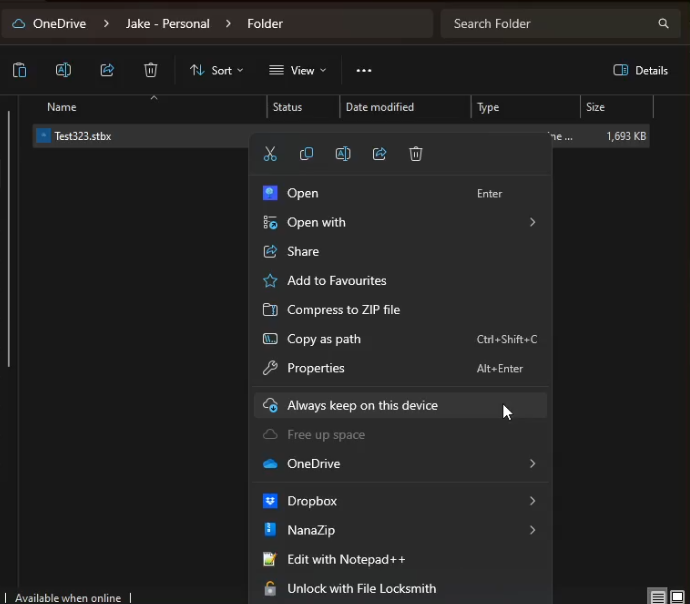
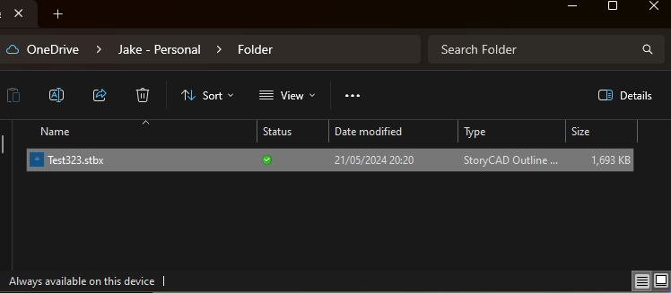

## Troubleshooting Cloud Storage Providers ##

Many people today use cloud storage providers like Google Drive, OneDrive, DropBox, etc. Most of the time these work flawlessly however there can be times when cloud storage providers can cause problems with StoryCAD. 
If you are having issues with StoryCAD and you store your outlines within a cloud storage provider or StoryCAD is showing the message above, then this page will walk you through troubleshooting these problems.

First its important to note that your outline isn’t lost/damaged or corrupted; it’s just not available locally to StoryCAD. 

With that out of the way, most problems with Cloud Storage Providers can be solved by simply connecting to the Internet or if you are already connected to the internet then  disconnecting and reconnecting should fix this. Once you have done this, try reopening the file within StoryCAD.

If the problem persists, then open File Explorer and navigate to the folder containing the Outline, if you don’t know where the file is located then StoryCAD will display the location of the outline if you hover over the name of the outline within the StoryCAD File Open Menu (pictured below).

Once you have found the file in your system, right click the file and find the option to make it available offline/Always keep on device. (The wording and location of the option will vary depending on the cloud storage provider)

If the problem still persists, then you should download the file from the cloud provider and store it somewhere that won’t be synced by the cloud storage provider.

If you’ve followed all the troubleshooting steps above and the issue still persists, please contact us. The Getting Help Page in the front matter section contains information on getting help.
  
  
[Previous - Leaving Feedback](Leaving_Feedback.md)  
[Next - Miscellaneous](Miscellaneous.md)  
